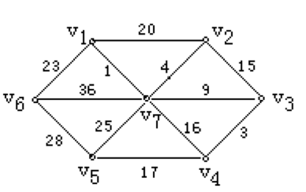

 <center><font size=72>离散数学大作业</font></center>


|     题目     |   最小生成树    |
| :----------: | :-------------: |
|   **姓名**   |   **鲍超俊**    |
|   **学号**   | **15020510059** |
| **指导老师** |   **李阳阳**    |


#### 一、相关概念

---

> **连通图**

​	在无向图中，若任意两个顶点$v_i$与$v_j$都有路径相通，则称该无向图为连通图。

> **强连通图**

​	在有向图中，若任意两个顶点$v_i$与$v_j$都有路径相通，则称该有向图为强连通图。

> **连通网**

​	在连通图中，若图的边具有一定的意义，每一条边都对应着一个数，称为权；权代表着连接连个顶点的代价，称这种连通图叫做连通网。

> **生成树**

​	一个连通图的生成树是指一个连通子图，它含有图中全部$n$个顶点，但只有足以构成一棵树的$n-1$条边。一颗有$n$个顶点的生成树有且仅有$n-1$条边，如果生成树中再添加一条边，则必定成环。

> **最小生成树**

​	在连通网的所有生成树中，所有边的代价和最小的生成树，称为最小生成树。


#### 二、Prim算法

---

> **输入**：

​	一个无向带权图G=(V,E)，对于每一条边(u, v)属于E，都有一个权值w。

> **输出**：

​	这个图的最小生成树，即最小代价和。

**算法伪代码**

```c#
foreach u in V{
    key[u] = inf;
	parent[u] = NIL;
}
key[r] = 0; Q = V;
while (Q != NULL){
    u = EXTRACT-MIN(Q);
	foreach v in Adj[u]{
		if (v in Q && w(u, v) < key[v]){
			parent[v] = u;
			key[v] = w(u, v);
		}	
	}
}
```


#### 三、实验报告

---

##### 1. 实验要求

​	如下图所示的赋权图表示某七个城市及预先算出他们之间的通信线路造价（单位：万元），试给出一个设计方案，试给出一个设计方案，使得各城市之间既能够通信又使总造价最小并计算其最小值。




##### 2. 实验结果


##### 3. 程序说明

> **Edge结构体**

```c++
typedef struct
{
    //边的两个端点，对应邻接矩阵中的第[row][col]元素。
	char row;
	char col;
}Edge;
```

> **Prim类**

```c++
class Prim
{
private:
    char visit[MAX_LINE]; //存储访问过的节点。
    char unvisited[MAX_LINE]; //存储未被访问过的节点。
    int visitIndex,unvisitedIndex,edgesIndex; //对应索引。
    Edge edges[MAX_LINE*MAX_LINE];
    
public:
    Prim(/* args */);
    ~Prim();
    void fit(char* graph);	// 输入邻接矩阵指针，打印最小生成树的边及权重和。
};
```

> **主函数**

```C++
#include "Prim.h"
#include<iostream>
using namespace std;
// 图的邻接矩阵
char graph[MAX_LINE*MAX_LINE]={
    -1, 20, -1, -1, -1, 23,  1,
    20, -1, 15, -1, -1, -1,  4,
    -1, 15, -1,  3, -1, -1,  9,
    -1, -1,  3, -1, 17, -1, 16,
    -1, -1, -1, 17, -1, 28, 25,
    23, -1, -1, -1, 28, -1, 36,
     1,  4,  9, 16, 25, 36, -1
};
int main()
{
    Prim prim=Prim();	// 创建Prim对象
    prim.fit(graph);	// 计算图的最小生成树
}
```

